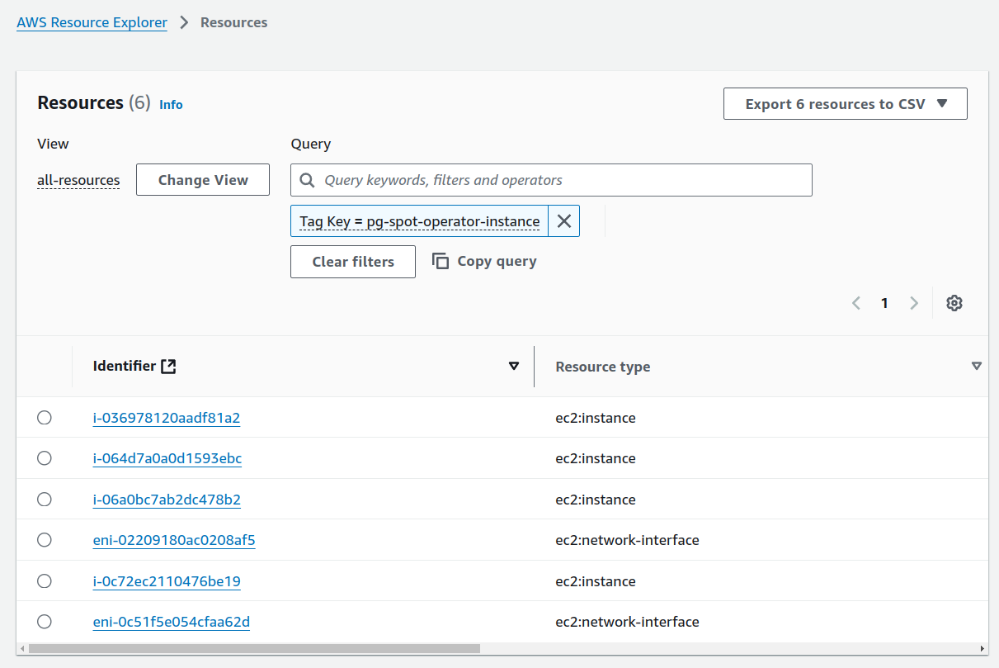

# Local non-cloud development

For Postgres setup testing, manifest handling etc, one can get by with local Virtualbox/Vagrant VMs, by using
according flags:

```bash
git clone git@github.com:pg-spot-ops/pg-spot-operator.git
cd pg-spot-operator
make virtualenv
source .venv/bin/activate
pip install -r requirements-test.txt

vagrant up && vagrant ssh -c 'hostname -I'  #  Or similar, add dev machine SSH keys ...

# Dev/test stuff

python3 -m pg_spot_operator --verbose --instance-name pg1 --vm-host 192.168.121.182 --vm-login-user vagrant

# If changing Python code

make fmt && make lint && make test

git commit
```

## Local Docker version

```commandline
docker build -f Containerfile -t pg-spot-operator:latest .

docker run --rm -e PGSO_INSTANCE_NAME=pg1 -e PGSO_REGION=eu-north-1 \
  -e PGSO_CPU_MIN=1 -e PGSO_STORAGE_MIN=10 -e PGSO_STORAGE_TYPE=local \
  -e PGSO_ADMIN_USER=pgspotops -e PGSO_ADMIN_USER_PASSWORD=topsecret123 \
  -v ~/.aws:/root/.aws:ro -v ~/.ssh:/root/.ssh:ro \
  pg-spot-operator:latest
```

## Cleanup of all operator created cloud resources

After some work/testing one can clean up all operator created cloud resources via `PGSO_TEARDOWN_REGION` or only a
single instance via the `PGSO_TEARDOWN` flag.

```
docker run --rm --name pg1 -e PGSO_TEARDOWN_REGION=y -e PGSO_REGION=eu-north-1 \
  -e PGSO_AWS_ACCESS_KEY_ID="$(grep -m1 aws_access_key_id ~/.aws/credentials | sed 's/aws_access_key_id = //')" \
  -e PGSO_AWS_SECRET_ACCESS_KEY="$(grep -m1 aws_secret_access_key ~/.aws/credentials | sed 's/aws_secret_access_key = //')" \
  pgspotops/pg-spot-operator:latest
```

or by running a helper script from the "scripts" folders (by default just lists the resources, need to add a parameter):

```
./scripts/aws/delete_all_operator_tagged_objects.sh yes
```

A third option for local Docker convenience, to avoid a restart with different inputs, is to create a dummy "destroy file"
inside the container that signals instance shutdown:

```commandline
docker run ...
# Note the destroy file path from the log
2024-09-30 10:49:38,973 INFO Instance destroy signal file path: /tmp/destroy-pg1
...
docker exec -it pg1 touch /tmp/destroy-pg1
# On the next loop the resources will be cleaned up and the container shuts down
```

PS The operator tags all created object with special `pg-spot-operator-instance` tags, thus teardown uses those also for the cleanup.

For an AWS side view on all the tagged resources one could run a query in the [AWS Resource Explorer](https://aws.amazon.com/resourceexplorer/),
looking something like:


